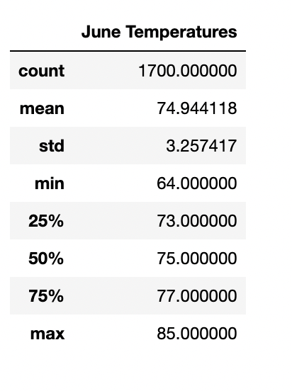
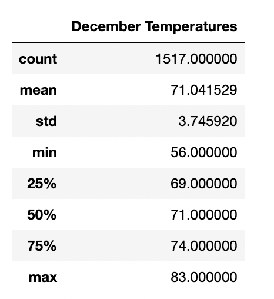

# surfs_up
## Overview
The overview of this analysis is to examine temperature trends for the months of June and December on the island of Oahu. These temperature trends will be used to determine if the surf and icecream shop store can be sustainable year-round.
## Results
### Trends during the month of June:

- The average temperagure for the month of June is 74.9 degrees.
- The lowest temperapture during the month of June is 64 degrees.
- The max temperature in June is a single degree greater compared to December.
### Trends during the month of December:

- The average temperature for the month of December was 71 degrees.
- the lowest temperature was 56 degrees, 8 degrees colder than the lowest temperature in June.
- The standard deviation of December is higher then Junes. 
## Summary
Based on the information provided, it would be recommended to open an ice cream store and surf shop on the island of Oahu. With June and December both seeing similiar weather, it is safe to say that the temperature is favorabel year round. Two queries that could be beneficial in perfomring would be comparing temperatures of June and December by station. Being able to compare each station and its data throughout the year could help provide a favorable location to open the store. A second query that could be performed could be one that shows swells throughout the year and their location. Different sides of the island could see different sweels at different times of the year. One side may be better for a surf shop then another side.
